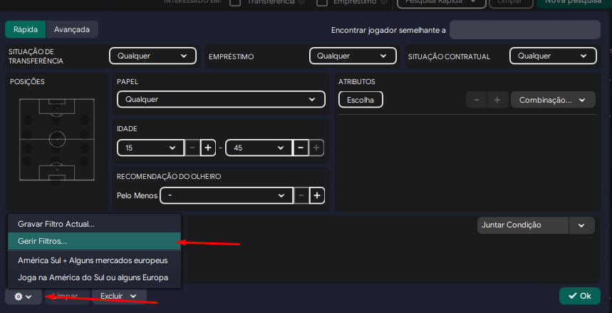
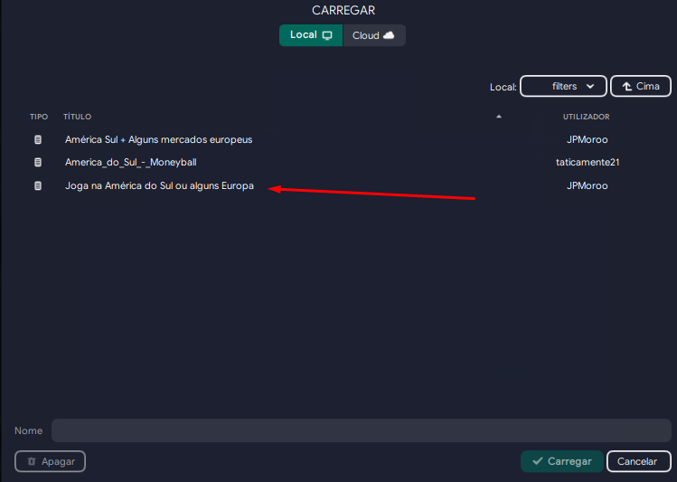
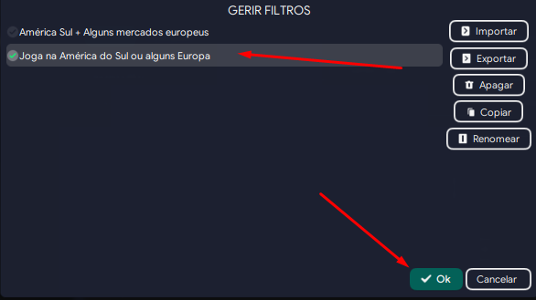

Abra o football manager e selecione a aba Observação.

Após isso, vá na aba Jogadores.

Clique em nova pesquisa.

Juntar condição.

Clube -> Divisão.

Após isso, você pode selecionar as ligas que você quer filtrar. Caso queira usar uma pré-definição que eu uso, basta seguir o passo a passo das próximas imagens.

Para importar a pré-definição, clique na engrenagem -> Gerir filtros.

Clique em importar e selecione o filtro que você vai importar. 

No meu caso, e no deste projeto, o nome que será disponibilizado na pasta do projeto é "Joga na América do Sul ou alguns Europa".

Selecione o arquivo que você importou e clique em Ok.

Abra novamente a engrenagem e selecione o arquivo que você importou.

Como pode ser visto, as ligas são selecionadas.

Caso quiser colocar mais alguns filtros, fique a vontade para realizar a seleção. 

OBSERVAÇÃO: Quanto mais jogadores forem selecionados, mais pesado fica o arquivo e mais o seu jogo/computador sofrerá na hora de importar os dados.

Selecione um jogador, dê ctrl+A para selecionar todos os jogadores e depois ctrl+P para exportar os arquivos. Selecione Página Web e clique em OK. Salve o arquivo onde você preferir.

Abra o arquivo que você salvou. Dê um ctrl+A para selecionar todos os jogadores.

Uma das alternativas para converter para um arquivo .csv é abrir um Google Sheets (<https://docs.google.com/spreadsheets/u/0/>), selecione a primeira célula e dê ctrl+V. Talvez seja necessário você apagar a primeira linha caso fique vazia, para isso clique no 1 que fica no canto esquerdo, aperte com o botão do mouse direito e em excluir linha. Após isso, salve como um arquivo .csv com o nome que você quiser. Nesse código, o nome é "jogadores.csv".

Uma outra alternativa caso o Google Sheets demore demais devido ao tamanho do arquivo e a quantidade de dados é o site <https://www.convertcsv.com/html-table-to-csv.htm>. 
Clique para escolher um arquivo e selecione o arquivo que você salvou.

Após carregar todos os dados, pode demorar um pouco, clique em Download Result para salver o arquivo .csv.

